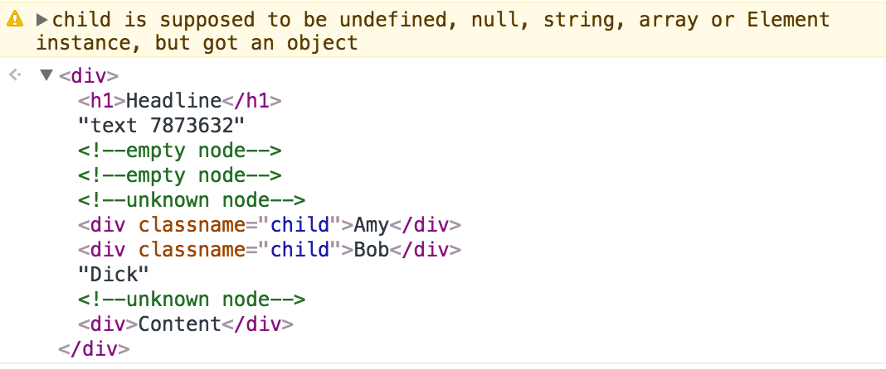

# Dool-DOM

> Dool-DOM is a basic implementation of DOM manipulation lib.

### Intro

With `Element` and `RenderDOM` offered by **Dool-DOM**, you can easily manipulate your DOM structure.

### Usage

`jsx` syntax is supported in this lib, and you can also use `Element.createElement` to create virtual DOM and render it to real DOM.

**Basic Usage**

```javascript
import { Element } from 'dool-dom';

const root = Element.createElement('div', {
  id: 'root',
  Element.createElement('h1', null, 'Hello Dool-DOM!'),
  Element.createElement('blockquote', null,
    Element.createElement('code', null, 'Dool-DOM'),
    ' is a basic implementation of DOM manipulation lib.'
  ),
});
```

**With JSX**

```jsx
import { Element } from 'dool-dom';

const root = (
  <div id="root">
    <h1>Hello Dool-DOM!</h1>
    <blockquote>
      <code>Dool-DOM</code> is a basic implementation of DOM manipulation lib.
    </blockquote>
  </div>
);
```

### Types of Params

| Type             | Result                           |
| ---------------- | -------------------------------- |
| Element instance | Element(DOMElement)              |
| String           | TextNode                         |
| Number           | TextNode                         |
| Undefined        | Comment(`<!-- empty node -->`)    |
| Boolean          | Comment(`<!-- empty node -->`)    |
| Null             | Comment(`<!-- empty node -->`)    |
| Object           | `TyperError`                      |
| Array            | DocumentFragment                 |
| Default          | Comment(`<!-- unknown node -->`)  |

#### example

```jsx
import { Element } from 'dool-dom';

const root = (
  <div>
    <h1>Headline</h1>
    text
    7873632
    {undefined}
    {null}
    {{ name: 'Dool-DOM' }}
    {[
      <div className="child">Amy</div>,
      <div className="child">Bob</div>,
      Math.random > 0.5 ? 'Cindy' : 'Dick',
      false
    ]}
    <div>Content</div>
  </div>
);
```

**output**

